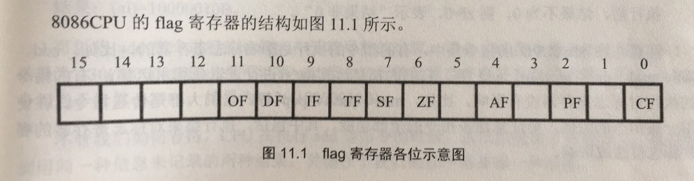

# 8086 Assembly 总结

## 首先，本总结参考了王爽的《汇编语言》  [8086指令详解](http://dsearls.org/courses/C391OrgSys/IntelAL/8086_instruction_set.html#AAA)  [BIOS/DOS功能详解](http://tinylab.org/assembly/fl/fl5.htm)  ASTZLS在这里感谢他们的知识贡献！最后，如果写者能力有限，请独立思考阅读。如有错误可以提Issue，或者Pull request。感谢大家！

### 一 [寄存器简介](#一-寄存器简介-1)

### 二 [指令用法](#二-指令用法-1)

### 三 [寻址总结](#三-寻址总结-1)

### 四 [中断总结](#四-中断总结-1)

### 五 [BIOS/DOS功能总结](#五-biosdos功能总结-1)

# 一 寄存器简介

## 8086中寄存器大小均为16位

## 通用寄存器：AX BX CX DX SI DI BP SP

## 段寄存器：CS DS SS ES

## 程序计数器：IP

## 标志位寄存器：PSW

## Uniform register常用用法介绍：

### 1.ax

通常用来存返回值，或者32位乘积的低16位，或者32位被除数的低16位，或者正常使用。

### 2.bx

可用于寄存器间接寻址，段前缀默认为ds。或者正常使用。

### 3.cx

可与loop类指令搭配使用，或作为子程序的第二个参数，或正常使用。

### 4.dx

作为子程序的第一个参数，或者32位乘积的高16位，或者32位被除数的高16位。

### 5.si

可用于寄存器间接寻址，段前缀默认为ds。或者正常使用。

### 6.di

可用于寄存器间接寻址，段前缀默认为ds。或者正常使用。

### 7.bp

可用于寄存器间接寻址，段前缀默认为ss。但与sp不同，bp的指向可以指向栈中任一位置，这样可以利用bp去读取通过栈传参的参数。

### 8.sp

栈指针，永恒指向栈顶，不要随意更改，除非是初始化栈空间，否则出大问题。

## Segment register常用用法介绍：

### 1.cs

存储程序段所在段的值，只能通过jmp等转移类指令更改其值。

### 2.ds

存储数据段所在段的值，只能通过寄存器作为源操作数进行赋值。

### 3.es

同ds，一模一样的用法

### 4.ss

存储栈段的值

## Special register简介：

### 1.ip

永远指向下一条将要执行的指令，同cs，只能用转移类指令赋值。

### 2.psw

用于保存上一次影响psw的指令的状态值。

psw的某些位都有其特殊的意义，如下所示：

#### ZF：零标志位。当结果为0时，ZF=1；否则，ZF=0

#### PF：奇偶标志位。当结果中的位为1的个数为偶数时，PF=1；否则，PF=0

#### SF：负标志位。当结果为负，SF=1；否则，SF=0

#### CF：进位标志位。当指令执行时，最高有效位还要进位的话，CF=1；否则CF=0

#### OF：溢出标志位。当指令执行时，结果超出有符号数的表示范围时，OF=1；否则OF=0

#### DF：若DF=1，串传送类指令执行后si，di递减；DF=0，si，di递增。

##### 以上标志位只有df，cf还有一个if可以通过特殊指令去控制值。其他不行！比如stc，将cf置位。

# 二 指令用法

## 传送类指令：

### 所有的传送类指令不会改变标志位，操作数不能同时为内存单元。操作数的位数必须匹配！

### 1.mov

mov dst,src ;将src的值复制一份给dst。dst不能是cs，ip寄存器。段寄存器作为dst时，src不能是立即数imm和段寄存器

### 2.xchg

xchg op1,op2 交换op1和op2的值

### 3.lea

lea reg,mem(Label) 将变量名或标号的偏移地址送给reg

### 4.in

in al/ax,imm 或 in reg,dx 将端口号为imm或dx的端口读出字节/字至al/ax

当端口号大于255(0ffh)时，必须将端口号存入dx再使用in。

### 5.out

out imm,al/ax 或 out dx,al/ax 将端口号为imm或dx的端口从al/ax写字节/字

当端口号大于255(0ffh)时，必须将端口号存入dx再使用out。

### 6.push/pushf

只有一个操作数src，将src压入栈中。src必须是16位的，src可以是寄存器（所有！除了psw，有自己的指令pushf，无操作数），也可以是内存单元！

### 7.pop/popf

和push类似，只有一个操作数dst，就是将栈顶的值给dst操作数。popf就是把值直接给标志寄存器，无操作数。

### 8.xlatb

查表指令，将查到的内容给al。使用前必须指定bx，al。bx指的是table的偏移地址，al是字节偏移量。

## 运算类指令

### 和传送类指令一样，操作数不能同时为内存单元，操作数的位数必须匹配！

### 会修改psw的值

### 1.add

add dst,src src+dst -> dst 没什么好说的

### 2.sub

sub dst,src dst-src -> dst 没什么好说的

### 3.mul/imul

被乘数放在al或ax里，乘数可以是内存单元或者是reg。如:mul bx ;mul word ptr [bx]

乘数和被乘数的位数必须相匹配，要么8位，要么16位。8位相乘的结果放在ax里。16位相乘的结果放在dx和ax里（其中，dx是高16位，ax是低16位）

mul和imul的区别：前者是无符号的乘法；后者是有符号数的乘法。

### 4.div/idiv

和mul类指令类似，被除数要么是32位的，要么是16位的。分别得到16位的商和余，或者8位的商和余。

被除数默认放在dx：ax或ax里。（dx：ax表示dx存高16位，ax存低16位，整体构成32位被除数）

操作数只能是16位或8位的，可以是reg或内存单元。

完了以后，商放在ax，余放在dx（32位被除）；或者ah放余数，al放商（16位被除）。

### 5.and

and dst,src 源操作数可以是reg，内存单元，或立即数。

src的各个位与dst的各个位相与（&&），结果放在dst中。

### 6.or

与and类似，只不过进行的是或操作（||）

### 7.xor

与and类似，进行的是异或操作。

小技巧：自己与自己异或可清0

### 8.adc

与add类似，但dst不仅是dst+src的和，还要加上CF的值。

### 9.sbb

与sub类似，但dst不仅是dst-src，还要减去CF的值。

### 10.neg

只有一个操作数op1，可以是reg，内存单元，但不能是imm（立即数）

就是将这个op1视作有符号数，得到的结果是这个op1的负数，用补码表示。

例如：MOV AL, 5   ; AL = 05h
		   NEG AL       ; AL = 0FBh (-5)

### 11.inc

只有一个操作数op1，可以是reg，内存单元，但不能是imm（立即数）

操作是op1=op1+1

### 12.dec

只有一个操作数op1，可以是reg，内存单元，但不能是imm（立即数）

操作是op1=op1-1

### 13.not

只有一个操作数op1，可以是reg，内存单元，但不能是imm（立即数）

操作是将op1点各个位取反。

注意：此命令不影响psw！

### 14.shl

shl op1,1/cl

意思就是将op1点各个位左移1位或者cl个位，CF保留最后一次移出的位，用0补位。

注意：当移动超过1位时，必须将移动的次数放在cl里！

### 15.shr

和shl类似，只不过操作是右移。

### 16.sal

功能和shl一样，完全一样！可是想象成这是有符号数的左移

### 17.sar

这个可不和shr一样。唯一的不同就是左边补的位和最高位一致。其他都一样。

例如：

MOV AL, 0E0h      ; AL = 11100000b
SAR AL, 1         ; AL = 11110000b,  CF=0.

MOV BL, 4Ch       ; BL = 01001100b
SAR BL, 1         ; BL = 00100110b,  CF=0.

### 18.rol/rcl

rol是循环左移，rcl是考虑cf的左移。

语法和前面的移位操作一样。

rol会将最后一次移出来的位存在cf中，并且每次补位就是补移出来的位。

rcl同rol，但补位是补cf的位。

例如：

STC               ; set carry (CF=1).
MOV AL, 1Ch       ; AL = 00011100b
RCL AL, 1         ; AL = 00111001b,  CF=0.

### 19.ror/rcr

类比rol，rcl。

## 功能性指令

### 1.cmp

cmp op1,op2

功能：op1-op2，根据结果设置psw的位（除了IF标志），不影响op1,op2的值

### 2.test

test op1,op2

功能：op1 && op2,根据结果设置SF ZF PF（判断大小三剑客），不影响op1，op2的值

### 3.call

call Label/reg/mem

如果是段间转移，要call far ptr Label

寄存器只能是段内转移。

mem看指向的是字还是双字，来进行段内或段间转移。

### 4.ret/retf/iret

ret用于段内转移返回的子程序

retf用于进行段间转移的子程序

如果形如ret imm，代表sp+=imm。譬如，子程序需要用栈传两个参数，则ret 4（每个参数占用2个字节）

iret是中断子程序的返回指令（必须用此，不能用ret或retf返回，出大问题）iret相当在retf多pop了psw

### 5.int

int imm

中断命令，是调用中断程序的指令！不能用call调用！

### 6.loop

loop label

根据cx的值,判断是否跳转到label，若cx=0，则不跳转，向下执行；否则，cx-=1，并且跳转label

### 7.jmp/jcc

jmp label/reg/mem

和call类似，不多说。设置ip的值，或者同时设置cs，ip。

jcc是jmp的condition版，根据psw来决定是否跳转（是否设置cs，ip），注意的是，jcc都是短转移，只支持-128～127的跨度（字节为单位）

### 8.st(flag)/cl(flag)

st为置，cl为清，能够设置CF AF DF的值

# 三 寻址总结

## 总共有11种寻址。

### 1.立即寻址（立即数）

如：mov ax,1234h

### 2.寄存器直接寻址（值由寄存器直接给出）

如：mov ax，bx

### 3.直接寻址（内存位置直接由立即数给出）

如:mov ax,[2000h]

### 4.寄存器间接寻址（内存位置由特殊的寄存器的值给出）

如：mov ax，[bx] 	bx可换成bp，si，di

### 5.寄存器相对寻址

如：mov ax,[bx+imm]  bx可换成bp，si，di

### 6.基址变址寻址

如：mov ax,[bx+si] 	bx也可以是bp，si也可以是di

### 7.相对基址变址寻址

如：mov ax,[bx+si+imm] 	bx也可以是bp，si也可以是di

### 8.段内直接寻址

jmp near ptr Label

### 9.段内间接寻址

jmp reg/word ptr mem

### 10.段间直接寻址

jmp far ptr label

### 11.段间间接寻址

jmp dword ptr mem

# 四 中断总结

## 中断分为内中断和外中断。

## 外中断又分为可屏蔽中断和不可屏蔽中断。

## 不可屏蔽中断的中断码固定是2。

## 内中断有int/into/除法错误/单步调试。

## 外中断根据外设发出，中断码也和外设有关。

## 我们的内存中，有一片固定的区域放置*<u>所有中断程序地址</u>*的表，从0000:0000到0000:03FF。总共1KB。每项占4Bytes（CS/IP），可存放256个中断程序的地址。高字存CS，低字存IP

## 中断程序，必须存放在永远不会被动的地方。否则，如果变动了，执行中断程序可能出现灾难性的后果！

## 所以怎么设置自己的中断程序呢？可以放在中断向量表的内存单元里（中断向量表没有那么多中断程序，所以有很多空间可用！）

## 简单分这么几个步骤：

### （1）自定义一个中断码

### （2）写中断程序

### （3）将中断程序的所有字节放在那片“永恒”区域里

### （4）在中断向量表存中断程序的段地址和偏移地址。

# 五 BIOS/DOS功能总结

### 只给出作者自己比较常用的。

## 1.BIOS

### 首先，BIOS的中断码为10h

### （1）置光标

入口参数：AH＝02H

BH＝显示页码

DH＝行(Y坐标)

DL＝列(X坐标)

### （2）显示字符

入口参数：AH＝09H

AL＝字符

BH＝显示页码

BL＝属性(文本模式)或颜色(图形模式)

CX＝重复输出字符的次数

### （3）上卷/下卷/清屏

入口参数：AH＝06H――向上滚屏，07H――向下滚屏

AL＝滚动行数(0――清窗口)

BH＝空白区域的缺省属性

(CH、CL)＝窗口的左上角位置(Y坐标，X坐标)

(DH、DL)＝窗口的右下角位置(Y坐标，X坐标)

## 2.DOS

### 首先，DOS的中断码是21h

### （1）从键盘读取字符

入口参数：AH＝01H，过滤掉控制字符，并回显

　				   ＝07H，不过滤掉控制字符，不回显

　				   ＝08H，过滤掉控制字符，不回显

出口参数：AL＝输入字符的ASCII码

### （2）输出字符

入口参数：AH＝02H

DL＝待输出字符的ASCII码

### （3）读字符串

AH＝0AH

DS:DX＝存放输入字符的起始地址

接受输入字符串缓冲区的定义说明：

　　1、第一个字节为缓冲区的最大容量，可认为是入口参数；

　　2、第二个字节为实际输入的字符数(不包括回车键)，可看作出口参数；

　　3、从第三个字节开始存放实际输入的字符串；

　　4、字符串以回车键结束，回车符是接受的最后一个字符；

　　5、若输入的字符数超过缓冲区的最大容量，则多出的部分被丢弃，系统并发出响铃，直到输入“回车”键才结束输入。 

例如：

　　BUFF　80, ?, 80 DUP(?)　　　;最多接受80个字符

### （4）输出字符串

入口参数：AH＝09H

DS:DX＝待输出字符的地址

说明：待显示的字符串以’$’作为其结束标志

### （5）读取当前时间

入口参数：AH＝2CH

出口参数：CH＝时(0-23)，CL＝分(0-59)，DL＝秒(0-59)，AL＝百分秒(0-99)